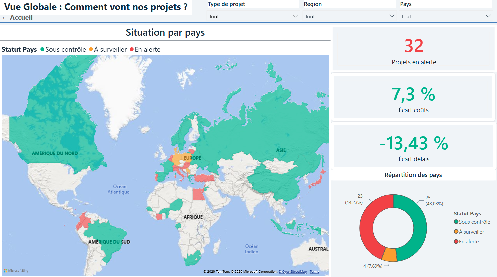
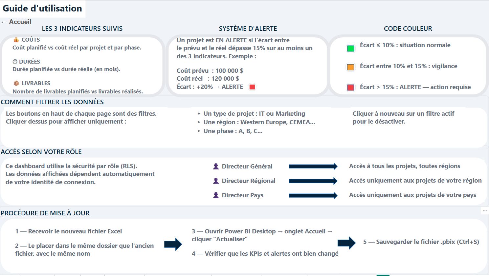
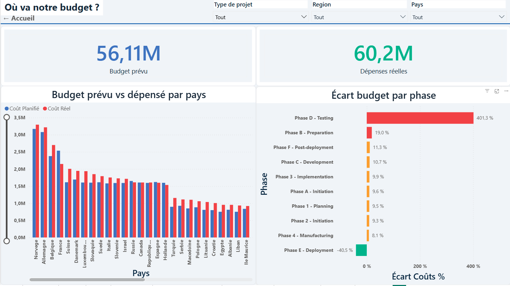
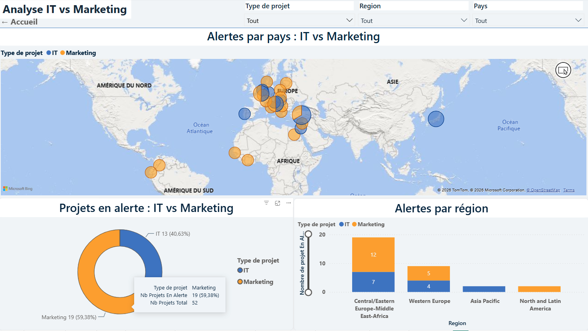
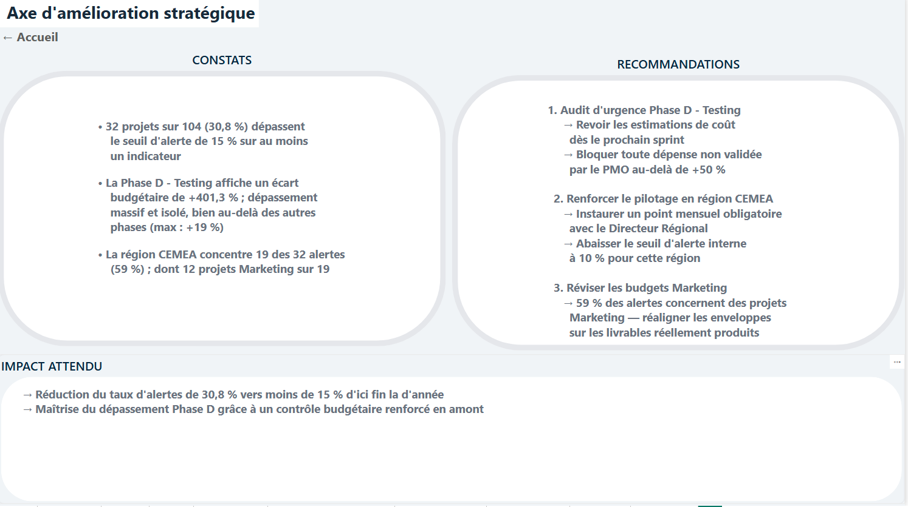
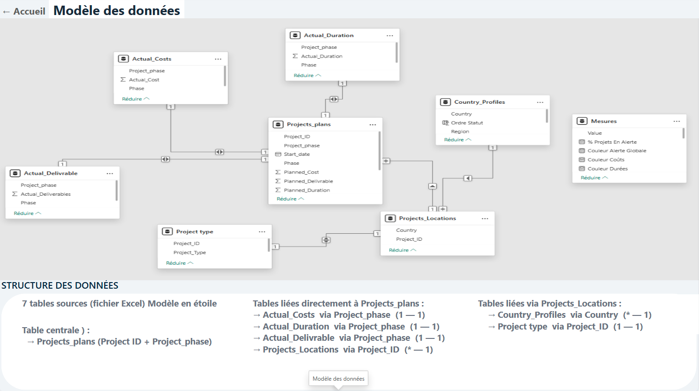

# 📊 Portefeuille de 104 projets dans 52 pays : alerter le bon directeur, et lui seul


104 projets IT et Marketing, 52 pays, 4 régions, et trois niveaux de direction qui n'ont pas le droit de voir les mêmes lignes. **Le piège de ce projet n'était pas de faire des graphiques : c'était de comprendre qu'un filtre n'est pas une sécurité.**



---

## 📖 Contexte

Sanitoral (cas fictif) fabrique des produits dentaires et pilote un portefeuille de projets dans 4 régions du monde. La responsable du bureau de gestion de projets pose le problème en une phrase : *« Beaucoup de données, mais ne sait pas comment les exploiter. »*

Deux familles de projets coexistent sans jamais se croiser :

- **IT** : 6 phases nommées A à F, qui se succèdent dans cet ordre
- **Marketing** : 4 phases numérotées 1 à 4

Trois indicateurs pilotent l'activité : les **coûts**, les **durées**, les **livrables**. Un écart de plus de **15 %** entre le prévu et le réel, sur l'un des trois, doit alerter les directeurs.

Et trois profils lisent le même rapport sans voir la même chose :

| Rôle | Ce qu'il décide | Ce qu'il voit |
|---|---|---|
| Directeur Général | Arrêter ou poursuivre un projet | Tous les projets, toutes régions |
| Directeur Régional | Intervenir auprès des pays de sa région | Les projets de sa région |
| Directeur Pays | Prendre les mesures correctives | Les projets de son pays |

---

## 🎯 Ce que j'ai fait

- Modélisé **7 tables Excel en étoile** autour d'une table de faits à clé composite
- Écrit **16 mesures DAX** : les 3 écarts, les compteurs d'alerte, les couleurs conditionnelles, un score de retard par pays
- Mis en place la **sécurité au niveau des lignes sur 3 rôles**, appliquée à l'identité de connexion
- Construit **9 onglets** dont une page d'analyse qui ne montre pas de données mais propose 3 décisions chiffrées
- Livré **les deux éléments optionnels du cahier des charges** : diagramme de Gantt et infobulles enrichies
- Rédigé un **guide d'utilisation intégré au rapport**, procédure de mise à jour en 5 étapes comprise

---

## 🔒 La décision qui structure tout : RLS, pas un filtre

Le réflexe naturel pour « chaque directeur voit sa région » est de poser un segment sur la région. C'est faux, et c'est le cœur du sujet.

Un segment est un filtre : l'utilisateur peut le décocher, ou cliquer sur la carte d'un autre pays, et il voit tout. Ce n'est pas de la confidentialité, c'est une vue par défaut.

J'ai donc utilisé la **sécurité au niveau des lignes**, ou RLS pour *row-level security*. Le filtrage est appliqué par le moteur à la connexion, en fonction de l'identité de l'utilisateur. Il n'existe aucun geste dans l'interface qui permette d'en sortir : les lignes hors périmètre ne sont pas masquées, elles ne sont jamais chargées.

Concrètement, trois rôles sont définis dans le modèle. Un directeur pays ouvrant le rapport voit les mêmes 9 onglets, les mêmes visuels, mais chaque agrégat est recalculé sur son seul périmètre.



---

## 🔍 Résultats clés

### 1️⃣ Un seul projet fausse la lecture de tout le portefeuille



**La Phase D — Testing affiche +401,3 % d'écart budgétaire.** La phase suivante la plus dégradée est à **+19 %**. Ce n'est pas une tendance, c'est un point isolé, et il déforme la moyenne du portefeuille.

C'est pour ça que la page Budget classe les écarts par phase au lieu d'afficher un pourcentage global : un seul chiffre agrégé aurait laissé croire à un dérapage généralisé, alors que 9 phases sur 10 sont sous les 20 %.

Le portefeuille pèse **56,11 M$ prévus contre 60,2 M$ dépensés**.

### 2️⃣ Les projets vont plus vite que prévu, coûtent plus cher, et livrent moins

Trois chiffres à lire ensemble, et pas séparément :

| Indicateur | Écart |
|---|---|
| Coûts | **+7,3 %** |
| Durées | **−13,4 %** |
| Livrables | **−10,5 %** |

Les durées sont raccourcies et les livrables manquants. Pris isolément, « −13,4 % sur les durées » ressemble à une bonne nouvelle. Mis à côté de « −10,5 % de livrables » et de « +7,3 % de coûts », la lecture change : les projets sont écourtés, livrent moins que prévu, et coûtent davantage.

C'est la raison pour laquelle le seuil d'alerte porte sur **les trois indicateurs à la fois**, et qu'un seul suffit à déclencher l'alerte.

### 3️⃣ Le problème n'est pas mondial, il est régional



**32 projets sur 104 sont en alerte, soit 30,8 % du portefeuille.** Mais ils ne sont pas répartis au hasard :

- **La région CEMEA concentre 19 de ces 32 alertes**, soit 59 %
- Dans cette région, **12 des 19 projets en alerte sont des projets Marketing**
- Sur l'ensemble du portefeuille, le déséquilibre se confirme : **19 alertes Marketing (59 %) contre 13 IT (41 %)**

Sur les 52 pays : 25 sous contrôle, 23 en alerte, 4 à surveiller.

La carte de la page Vue Globale existe pour ça. Une liste triée aurait donné les mêmes chiffres, mais elle n'aurait pas montré que les alertes se concentrent géographiquement.

---

## 💡 Conclusion

Un tableau de bord qui s'arrête au constat laisse la décision à quelqu'un d'autre. L'onglet **Axe d'amélioration stratégique** ne contient aucun graphique : il transforme les trois constats ci-dessus en trois décisions chiffrées.



1. **Audit d'urgence de la Phase D**, avec blocage de toute dépense non validée au-delà de +50 %
2. **Point mensuel obligatoire en région CEMEA**, avec un seuil d'alerte interne abaissé de 15 % à 10 %
3. **Réalignement des enveloppes Marketing** sur les livrables réellement produits

Objectif affiché : **ramener le taux d'alertes de 30,8 % à moins de 15 %**.

---

## 🗂️ Les données



**7 tables sources**, un seul fichier Excel, un modèle en étoile autour de `Projects_plans`.

La table centrale porte une **clé composite** `Project_ID` + `Project_phase`, parce qu'un projet existe en autant de lignes que de phases. C'est cette clé qui permet de relier le réel au planifié phase par phase :

| Table | Relation | Via |
|---|---|---|
| `Actual_Costs` | 1 — 1 | `Project_phase` |
| `Actual_Duration` | 1 — 1 | `Project_phase` |
| `Actual_Delivrable` | 1 — 1 | `Project_phase` |
| `Projects_Locations` | * — 1 | `Project_ID` |
| `Country_Profiles` | * — 1 | `Country`, via `Projects_Locations` |
| `Project type` | 1 — 1 | `Project_ID`, via `Projects_Locations` |

Une table `Mesures` isole les calculs DAX du reste du modèle. **16 mesures** alimentent les visuels :

- **Les agrégats** : `Coût Planifié Total`, `Coût Réel Total`, `Durée Planifiée (h)`, `Nb Projets Total`
- **Les écarts** : `Écart Coûts %`, `Écart Durées %`, `Écart Livrables %`
- **Les alertes** : `Nb Projets En Alerte`, `% Projets En Alerte`, `Statut Pays`, `Score Retard Pays`
- **Les couleurs conditionnelles** : `Couleur Alerte Globale`, `Couleur Coûts`, `Couleur Durées`, `Couleur Livrables`

Les couleurs sont des mesures, pas une mise en forme manuelle. Le code est appliqué une fois et se propage à tout le rapport : vert sous 10 %, orange entre 10 et 15 %, rouge au-delà.

---

## 🧭 Les 9 onglets

| # | Onglet | Ce qu'on y trouve |
|---|---|---|
| 1 | [Accueil](captures/01-accueil.png) | Navigation par boutons, volumétrie du portefeuille |
| 2 | [Vue Globale](captures/02-vue-globale.png) | Carte mondiale par statut, projets en alerte, écarts coûts et délais |
| 3 | [Budget](captures/03-budget.png) | Prévu contre réel par pays, écart budgétaire par phase |
| 4 | [Délais](captures/04-delais.png) | Diagramme de Gantt par phase, retard par phase |
| 5 | [IT vs Marketing](captures/05-it-vs-marketing.png) | Alertes par pays et par région, comparaison des deux familles |
| 6 | [Axe d'amélioration](captures/06-axe-amelioration.png) | Constats, recommandations, impact attendu |
| 7 | [Modèle des données](captures/07-modele-donnees.png) | Le schéma en étoile documenté dans le rapport lui-même |
| 8 | [Guide d'utilisation](captures/08-guide-utilisation.png) | Indicateurs, alertes, filtres, rôles, procédure de mise à jour |
| 9 | [Mise à jour](captures/09-mise-a-jour.png) | Le cadrage d'origine et les 9 user stories |

Une [page d'infobulle](captures/10-infocarte.png) dédiée enrichit le survol de la carte : pays, score de retard, nombre de projets en alerte.

---


## 🛠️ Technologies utilisées

Power BI Desktop · DAX · Power Query · modèle en étoile à clé composite · sécurité au niveau des lignes (RLS) · mise en forme conditionnelle par mesures · visuel personnalisé (Gantt) · page d'infobulle

---
## 🚀 Ouvrir le rapport

Le fichier `.pbix` s'ouvre avec [Power BI Desktop](https://powerbi.microsoft.com/desktop/), gratuit, sous Windows.

```
1. Télécharger portefeuille-projets-sanitoral.pbix
2. L'ouvrir dans Power BI Desktop
3. Naviguer depuis la page Accueil, chaque bouton mène à un onglet
```

Les données sont embarquées dans le fichier : aucune source externe à connecter, aucun identifiant à saisir.

Pour voir la sécurité par rôle en action : **Modélisation → Afficher en tant que**, puis choisir un des 3 rôles. Les agrégats se recalculent sur le périmètre choisi.

---
## 📂 Structure du dépôt

```
captures/                              une image par onglet du rapport
portefeuille-projets-sanitoral.pbix    le rapport complet, données embarquées
```

---
## 📈 Compétences démontrées

### Modélisation
- ✅ Modèle en étoile à partir de 7 tables plates, sans table de faits préexistante
- ✅ Clé composite `Project_ID` + `Project_phase` pour relier le réel au planifié phase par phase
- ✅ Table de mesures isolée du modèle physique

### Sécurité et gouvernance
- ✅ Sécurité au niveau des lignes sur 3 rôles, appliquée à la connexion et non par un filtre
- ✅ Périmètre de chaque directeur défini dans le modèle, impossible à élargir depuis l'interface
- ✅ Procédure de mise à jour documentée dans le rapport, pour qu'il survive à son auteur

### Restitution
- ✅ Seuil d'alerte unique à 15 %, appliqué aux 3 indicateurs simultanément
- ✅ Code couleur porté par des mesures DAX, pas par une mise en forme manuelle
- ✅ Une page d'analyse sans aucun graphique, qui transforme les constats en 3 décisions chiffrées
- ✅ Les deux éléments optionnels du cahier des charges livrés : Gantt et infobulles enrichies

### Lecture des données
- ✅ Écart isolé de +401,3 % identifié comme point aberrant et non comme tendance
- ✅ Trois indicateurs lus ensemble plutôt que séparément, ce qui inverse la conclusion
- ✅ Concentration géographique des alertes mise en évidence par la carte, pas par un classement

---

## 📧 Contact

**Helton Dos Santos Moreira**
Data Analyst / Data Engineer | 10 ans d'expérience business (retail et e-commerce)

- 📧 Email : heltonmail8@gmail.com
- 💼 LinkedIn : [in/helton-dsm-data](https://linkedin.com/in/helton-dsm-data)
- 🐙 GitHub : [Heltondsm](https://github.com/Heltondsm)

---

## 🔗 Autres projets

- [Tendances du streaming musical](https://github.com/Heltondsm/analyse-streaming-musical), 114 000 morceaux, tests statistiques et prévision Prophet comparée à un modèle naïf
- [Pipeline dbt : profils sociodémographiques](https://github.com/Heltondsm/dbt-demographics-pipeline), Snowflake et DuckDB, 26 tests, reproductible en une commande
- [Pipeline de veille du marché de l'emploi](https://github.com/Heltondsm/job-market-pipeline), APIs France Travail et INSEE Sirene, 698 offres et 1 166 entreprises en 11 secondes
- [Audit qualité d'un catalogue e-commerce](https://github.com/Heltondsm/python-audit-donnees-catalogue), croisement de 3 sources, 277 000 € de stock immobilisé mis en évidence

---

**Projet réalisé entre mars et mai 2026**
